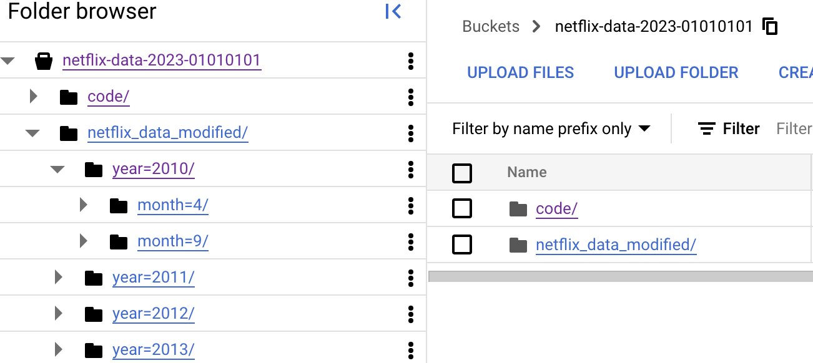
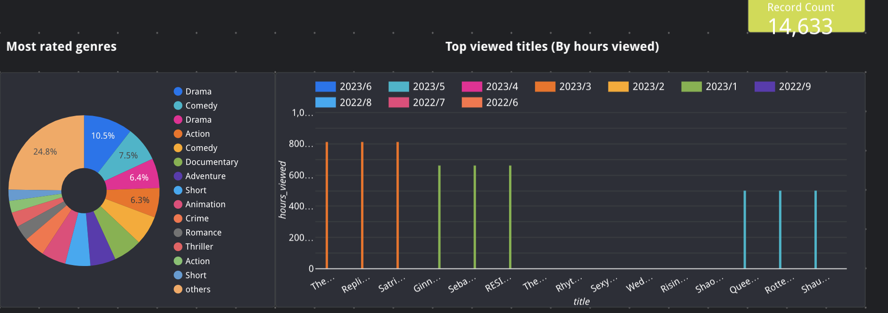
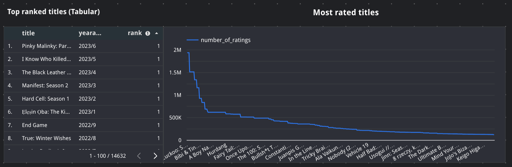
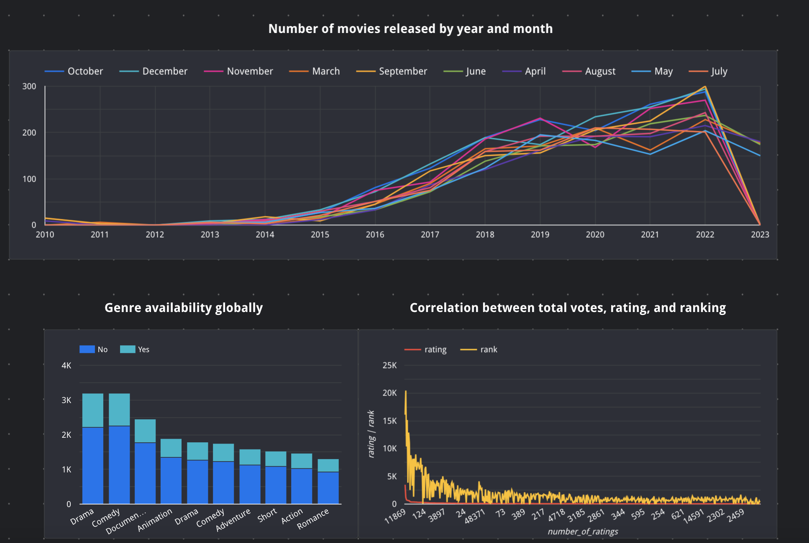

# Netfix movie data analysis

# Problem description

This project is about netflix movies data analysis. This project looks at the netflix movies data and recommends good movies for the users. The recommendations for the movies are based on movie ratings and also on the number of votes made by other users. The recommendations also provide suggestions on top movies by genre. 

# Project architecture details

We will get movies data as a daily feed from an input source. We run orchestration through MageAI using an orchestrator pipeline. The orchestrator pipeline will perform ETL by loading the data from remote storage (extract), perform transformation of the data to make it compatible for downstream analysis(transform), and finally loading the transformed data to google cloud storage. The storage in google cloud is partitoned by year and month.  The tranformed data will then be run through a spark transformation job and will be transformed and processed to load the final data for visualization to GCP big query table. <br/>
We use terraform to create part of the cloud resources (exception being dataproc job) such as cloud storage and big query schema. We run orchestrator as a docker container and produce data to these cloud resources. 


# Low level design details
The file is in CSV format with below columns and sample values. <br/>

| Title | Available Globally? | Release Date | Hours Viewed? | Number of Ratings | Rating | Genre | Key Words | Description |
|---|---|---|---|---|---|---|---|---|
| The Night Agent: Season 1 | Yes | 2023-03-23 | 812100000 | 7696.0 | 6.0 | ["Biography, Drama, History"] | "persian empire,empire,5th century b.c.,achaemenid empire,persia" | "The film follows headstrong Ginny who meets Sunny for an arranged marriage, but turns him down, and then shows how Sunny teams up with Ginny's mother to win her love." |

1. Extraction job - Mage orchestrator is used for extraction. The [extract_data.py](./mage_orchestrator/mage-netflix-movies/data_loaders/extract_data.py) file extracts data from a data source. In this project I have used a simple data file loaded and ready to use in a github location. The file can be viewed [here](https://raw.githubusercontent.com/amohan601/dataengineering-netflix-movies/main/total_netflix_2023.csv). 

2. Transformation job - Transformation included identifying the right schema for the data, cleaning up the genre column, handling null and empty values for different critical columns and so on. The transformer in mage that does this functionality is [transform_data.py](./mage_orchestrator/mage-netflix-movies/transformers/transform_data.py)

3. Loading the data - Mage orchestrator performs loading the data from CSV file after transformation into google cloud storage bucket under a folder called netflix_data_modified. The file for loading the data to google cloud storage under a folder of the given bucket is  [load_data.py](./mage_orchestrator/mage-netflix-movies/data_exporters/load_data.py) The data is loaded into cloud storage bucket with partitioning by year and month. 

##### google cloud storage (partioned by date and month)


4. Spark job to transform the final data - Once the pipeline completes execution, we need to run the spark job to transform the ready to prepare for visualization and then loading the prepared data to bigquery tables. For the purpose of this project spark is run using dataproc and requires a dataproc cluster in google cloud started and ready to run when a spark job is submitted.
The file to perform spark job and load transformed data to big query table is [LoadToBigQuery.py](./scripts/LoadToBigQuery.py). Spark job explodes the comma seperated genre types along with other relevant columns to a seperate table called <b><i>netflix_genre</i></b>. It also produces the netflix movies information along with a calculated rank (calculated by considering number of movie ratings and rating itself for a given year and month) into <b><i>netflix_movies</i></b>. In addition to showcase top titles data has been produced to <b><i>netflix_top_movies</i></b>

##### Tables in bigquery schema


##### netflix_genre


##### netflix_movies


##### netflix_top_movies


5. Running the pipeline using trigger - To run the pipeline mage trigger has been used with a schedule of once a day. Currently it is set up for an adhoc run. 

6. Viewing the visualization - Visualization has been done in looker studio and details are attached in the steps below. Report can be found [here](./visualization/Netflix_ratings_visualizations.pdf)

# Steps to replicate the project

## Prerequisites
<li> User should have google cloud account and GCP credentials to access the account.
<li>  User should have google cloud SDK downloaded and made available for CLI to run gcloud scripts.
<li>  User should have terraform downloaded and made available.
<li>  User should have dataproc cluster deployed and started (to run pyspark jobs). 


### Step 1 - Download the code

The code to run the project can be downloaded from here. 
CD into the root project folder.

Folder structure explained
1. Root folder is dataengineering-netflix-movies
2. The dataset csv file is in the root folder
3. Scripts to perform various actions are in scripts folder
4. Mage pipeline code is in mage_orchestrator folder


```
cd dataengineering-netflix-movies
```


### Step 2 - Create google cloud resources
Running the resource creation and set up script for various resources.
This step will all the necessary resources needed for running this project.
The script will navigate to terraform folder and run and generate terraform resources. 
Replace the variable values below with the appropriate path from your local set

<br/>
Ensure to run  below commands for permissions   if needed to allow execute priviles to the file. 
Ensure to run the scripts from the root folder.

```
chmod +x ./scripts/terraform-pipeline-create.sh
chmod +x ./scripts/terraform-pipeline-teardown.sh
chmod +x ./scripts/start-mage-container.sh
chmod +x ./scripts/run-spark-job.sh
```

Once the above scripts are run, next step is to run the below script to create the required terraform resources.
```
TERRAFORM_HOME="<path_to_terraform>"
GCP_CREDS="<path_to_gcp_credentials_json_file_eg /usr/gcp-creds.json>"
PROJECT_ID="<path_to_gcp_project_id"
REGION="us-east1"
LOCATION="US"
BUCKET_NAME="netflix-data-2023-01010101"
BIGQUERY_DATASET_NAME="netflixdata12344"
./scripts/terraform-pipeline-create.sh $TERRAFORM_HOME $GCP_CREDS $PROJECT_ID $REGION $LOCATION $BUCKET_NAME $BIGQUERY_DATASET_NAME
```

### Step 3 - Execute mage scripts to set up the orchestrator

##### Running mage locally as a container


```
cd mage_orchestrator
```

Copy the contents of your gcp credentials json file to the <b>gcp-creds.json</b> file in Mage folder. <b>Once finished cd back to root folder. </b>

User should have docker available if running Mage setup in desktop as docker container.
The script will naviagate to mage_orchestrator folderdownloaded from the github  and run and set up mage pipeline for this project. Once the container is up and running, the mage link can then be accessed as http://localhost:6789
Ensure to use same bucket as the one previously created.
Ensure to run the script from the root folder.
```
PROJECT_ID="<path_to_gcp_project_id>"
BUCKET_NAME="netflix-data-2023-01010101"
./scripts/start-mage-container.sh $PROJECT_ID $BUCKET_NAME
```

### Step 4 - Run the pipeline

#### Run the pipeline script

To replicate the steps manually run the pipeline once using the trigger option. No argument is required since by default the file is set in environment variable path for the docker container. Bucket name and Big query dataset name are also passed into docker contain when starting the container.

To trigger the job in pipeline see below


#### Run the spark script for post transformation
This step will run and execute spark transformation on the data in google cloud storage and load the data to bigquery. The default mode is to overwrite the data in bigquery tables every time the job runs, however an argument can be passed to the job to append the data when the job runs in batch mode to keep loading the data to bigquery.

Replace the variable values below with the appropriate path from your local set
Ensure to use same bucket as the one previously created.
Ensure to use the same bigquery schemas as the one previously created.
The dataproc cluster name is the name of the dataproc cluster you have created and ready to run the spark job. GCLOUD is required to run the spark job.
Ensure to run the script from the root folder.
```
GCP_CREDS="<path_to_gcp_credentials_json_file>"
BUCKET_NAME="netflix-data-2023-01010101"
GCLOUD_UTIL_PATH="<google_cloud_sdk_bin_path>"
DATAPROC_CLUSTER_NAME="<dataproc_cluster_name>"
DATAPROC_CLUSTER_REGION="us-central1"
DATAPROC_TEMPBUCKET_NAME="<dataproc_temp_bucket_name_for_sparkjobs>
BIGQUERY_SCHEMA_NAME="netflixdata12344"
./scripts/run-spark-job.sh $GCP_CREDS $BUCKET_NAME $GCLOUD_UTIL_PATH $DATAPROC_CLUSTER_NAME $DATAPROC_CLUSTER_REGION $DATAPROC_TEMPBUCKET_NAME $BIGQUERY_SCHEMA_NAME

```


### Step 5 - View the visualization

#### Visualizatin part 1
The below image shows three tiles. The first tile shows the total record count being processed. The second tile shows a pie chart where the most popular genres are listed based on the number of ratings across the movie titles for those genre. The next diagram shows a bar chart of the most watched movie titles for a given year and month based on the hours viewed field.



#### Visualizatin part 2
The visualization show here on left side is tabular data of top movies based on ranking every month. The next tile is a bar chart showing the most rated movies based on the number of votes given by users.



#### Visualizatin part 3

The visualization here shows a time series chart with a general trend of movie release over the years. It can be observed that there were more releases from 2017 onwards and after. The next is a stacked bar chart showing which genres are available globally. It can be noticed that most genres are not available globally. Finally a correlation between total votes gives by users and the rating itself is shows. This is an important chart to indicate the ranking we calcualated based on total votes vs rating vs ranking is highly correlated indicating that movies with most votes vs tend to have a higher rating and hence higher ranking. 




#### Visualizatin part 4

The final visualization shows Top 3 movie titles (top in terms of ranking). There are movies that are tied to same rank and hence multiple movies exist every month with title of top 3. The second chart below shows the specific movies ranked in order as 1, 2, 3 for each month. 


### Step 6 - Tear down everything

Once all the testing is done, run the below scripts to tear down all the terraform resources that were created. <br/>
Ensure to use same bucket as the one previously created.
Ensure to use the same bigquery schemas as the one previously created.
Ensure to run the script from the root folder.
```
TERRAFORM_HOME="<path_to_terraform>"
GCP_CREDS="<path_to_gcp_credentials_json_file>"
PROJECT_ID="<path_to_gcp_project_id"
REGION="us-east1"
LOCATION="US"
BUCKET_NAME="netflix-data-2023-01010101"
BIGQUERY_DATASET_NAME="netflixdata12344"
./scripts/terraform-pipeline-teardown.sh $TERRAFORM_HOME $GCP_CREDS $PROJECT_ID $REGION $LOCATION $BUCKET_NAME $BIGQUERY_DATASET_NAME

```


### Future improvements

1. Change the input source to be a cloud storage. Make changes in extractor to support loading from cloud storage.

2. Manage dataproc cluster creation via terraform 

3. Run spark job as a step in orchestrator
